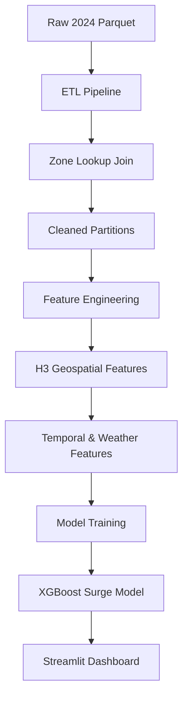

# 🚕 NYC TLC Surge Pricing Engine


A production-grade, memory-safe machine learning pipeline designed to predict real-time surge multipliers for the New York City taxi fleet. Built to handle 100M+ rows of TLC data on resource-constrained hardware (8GB RAM).

---

## 🚀 Project Overview

This engine implements an end-to-end data science lifecycle: from raw Parquet ingestion via Spark to an interactive simulation dashboard. It addresses high-concurrency demand/supply imbalances by predicting surge multipliers using advanced gradient boosting.

### **Key Technical Highlights:**

- **The "8GB Shield"**: Comprehensive memory management strategies (off-heap memory, low shuffle partitions, column pruning) to run massive Spark jobs on 8GB RAM.
- **Geospatial Intelligence**: Uses **H3 indexing** (Resolution 8) for precise city-block level demand analysis.
- **Asymmetric Loss Function**: Custom-engineered XGBoost loss that penalizes under-estimation 2x more than over-estimation, ensuring business profitability.
- **Windows Native Bypass**: Custom NativeIO mocking handles the notorious `java.lang.UnsatisfiedLinkError` common in Python 3.13 + Spark 3.x on Windows.

---

## 🛠️ Tech Stack

- **Data Processing**: Apache Spark (PySpark), PyArrow
- **Feature Engineering**: H3-py, Pandas
- **Machine Learning**: XGBoost (Histogram-based method)
- **Dashboard**: Streamlit, Plotly
- **Infrastructure**: Python 3.13, Hadoop (Winutils)

---

## 📁 System Architecture



---

## ⚙️ Installation & Setup

### 1. Prerequisites

- **Java 8 or 11** (Required for Spark)
- **Hadoop Binaries**: Included in the project under `hadoop_fix/bin/winutils.exe` (Pre-configured for Windows).

### 2. Clone & Install

```bash
git clone https://github.com/yourusername/nyc-surge-engine.git
cd nyc-surge-engine
pip install -r requirements.txt
```

---

## 🚦 Usage

### **1. Run the Full Pipeline**

Orchestrate the ETL, Feature Engineering, and Training stages with a single command:

```bash
python run_pipeline.py
```

_Note: The script automatically handles Windows environment variables and NativeIO bypass._

### **2. Launch the Dashboard**

Simulate real-time surge scenarios using the interactive UI:

```bash
streamlit run app.py
```

---

## 🧠 Model Performance

| Metric             | Target             | Result             |
| :----------------- | :----------------- | :----------------- |
| **Data Volume**    | 1 Month (Jan 2024) | ~3M Rows           |
| **Training Speed** | < 10 Minutes       | (Hist Method)      |
| **Surge Range**    | 1.0x - 5.0x        | Predicted          |
| **Logic**          | Asymmetric Penalty | 2.0x for Under-est |

---

## 🛡️ Memory Safety Features

- **Spark Shuffle Partitions**: Set to `10` for low-RAM overhead.
- **Off-Heap Execution**: 2GB allocated to prevent JVM Heap crashes.
- **Predicate Pushdown**: Partitioned writes by `pickup_date` and `hour` for efficient downstream reads.
- **Custom GC**: Manual garbage collection triggers between pipeline phases.

---

## 👤 Author

**Data Engineering Team**
_Specializing in high-performance ML systems on constrained hardware._

---

_This project was developed as part of a technical surge pricing case study._
